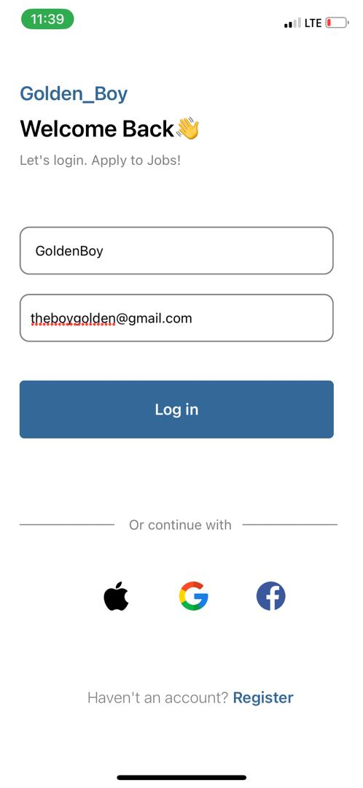
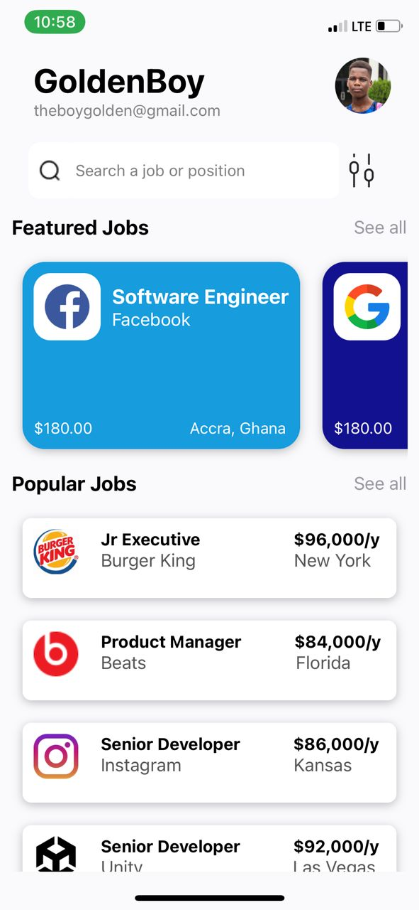

# 11020486 - Job App

This is a simple job application built with React Native. The app allows users to explore a wide range of jobs. Below is a brief description of each component's usage.

## Components

### App.js
This is the main component that renders the entire application. It includes a SafeAreaView and ScrollView to ensure the app content is displayed correctly on different devices and allows scrolling. It also sets up the stack navigator and handles the initial navigation setup.

### LoginComponent.js
This component provides a login form with fields for name and email. It includes a "Log in" button, social login options, and a registration link. Upon successful login, it navigates to the Homepage.

### Homepage.js
This component displays the homepage with a search bar for job positions, a filter option, and lists of featured and popular jobs. 

### featureJobCard.js
This component renders a horizontal list of featured job cards using ScrollView. Each card displays job details such as title, company, location, and an image. The cards have different background colors based on the job data.

### JobCard.js
This component renders individual job cards for popular jobs. Each card includes job details such as title, company, location, and an image.

### Core Components Used:
- `View`: Used as a container for other components.
- `Text`: Displays text in the app.
- `ScrollView`: Allows for vertical and horizontal scrolling of content.
- `TextInput`: An input field for user text entry.
- `StyleSheet`: Creates a style sheet to style components.
- `Image`: Displays images, such as user avatars and category icons.
- `TouchableOpacity`: A button that responds to touch events.

## Screenshots of the app on IPhone X using Expo go App

